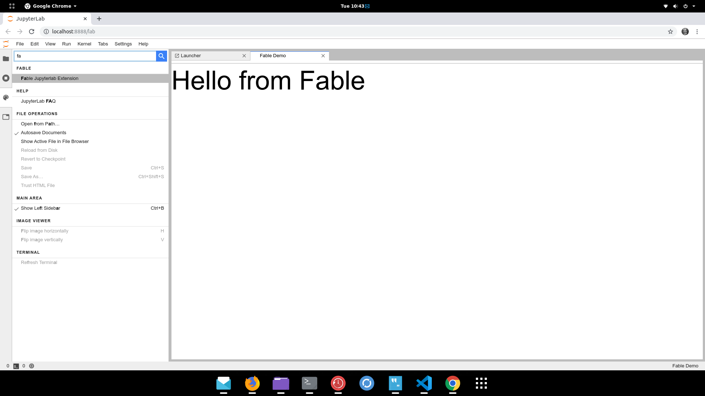

# fable-jupyterlab-extension

An example [JupyterLab](https://jupyterlab.readthedocs.io/en/stable/) extension with [Fable](https://fable.io/) tooling.

This repo can be considered as part tutorial, part template for making new JupyterLab extensions using Fable.

If you've never made a Jupyterlab extension before, I strongly recommend you [complete the standard tutorial](https://jupyterlab.readthedocs.io/en/stable/developer/extension_tutorial.html).

This repo is based on that tutorial, approximately midway through (complex enough to show nontrivial behavior but simple enough to understand almost immediately). 

Rather than displaying astronomy pictures of the day, the extension in this repo displays a message in a new tab when launched from the command palette.




## Prerequisites

* [JupyterLab](https://jupyterlab.readthedocs.io/en/stable/getting_started/installation.html)
* [Fable](https://fable.io/)
* An F# editor like Visual Studio Code with [Ionide](http://ionide.io/) 
* Chrome

## Installation

```bash
jupyter labextension install fable-jupyterlab-extension
```

## Development

This is based on my personal preferences. For more options, [see the extension development guide](https://jupyterlab.readthedocs.io/en/stable/developer/extension_dev.html#developer-extensions).

### Initial install and after library adds

```bash
npm install
mono .paket/paket.exe install
```

### Terminal A in VSCode

```bash
jupyter labextension install . --no-build
npm run watch
```

This will watch your F# code and trigger builds of `index.js`.

If you prefer not to trigger builds using a watch, you can `npm run build` every time you want a new build.

### Terminal B in VSCode

```bash
jupyter lab --watch
```

This will watch your extension and trigger builds of it.

Even with this watch, you still need to refresh your browser during development.

## Project structure

### npm/yarn

JS dependencies are declared in `package.json`, while `package-lock.json` is a lock file automatically generated.

### paket

[Paket](https://fsprojects.github.io/Paket/) 

> Paket is a dependency manager for .NET and mono projects, which is designed to work well with NuGet packages and also enables referencing files directly from Git repositories or any HTTP resource. It enables precise and predictable control over what packages the projects within your application reference.

.NET dependencies are declared in `paket.dependencies`. The `src/paket.references` lists the libraries actually used in the project. Since you can have several F# projects, we could have different custom `.paket` files for each project.

Last but not least, in the `.fsproj` file you can find a new node: `	<Import Project="..\.paket\Paket.Restore.targets" />` which just tells the compiler to look for the referenced libraries information from the `.paket/Paket.Restore.targets` file.

### Fable-splitter

[Fable-splitter]() is a standalone tool which outputs separated files instead of a single bundle. Here all the js files are put into the `lib`. And the main entry point is our `index.js` file.

### Imports

Because Jupyter uses Typescript, we can use [ts2fable](https://github.com/fable-compiler/ts2fable) to generate strongly typed imports of Jupyter's JS packages. Unfortunately these are a bit huge and the conversion is messy. `Jupyter.fs` contains the minimal imports for this demo repo, and these imports were tweaked out of the files in the `ts2fable-attempt` directory.


